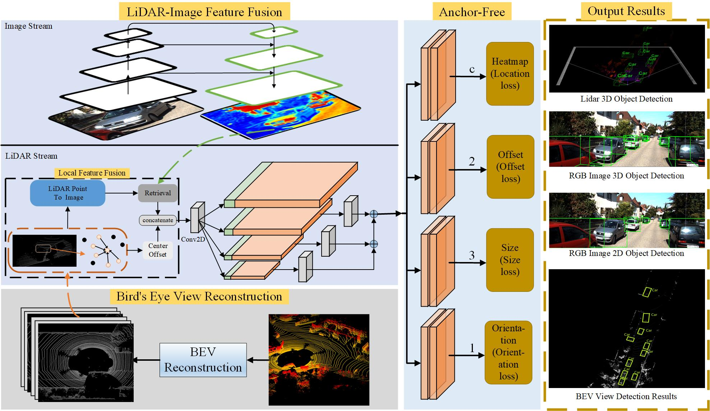

# MMF-AF
# Anchor-free 3D Object Detection using Multimodal Fusion

# Overall structure diagram of the method


# Dataset Preparation
Please download the official [KITTI 3D object detection]
The format of how the dataset is provided:
```
MMF-AF
├── data
│   ├── kitti
│   │   │── ImageSets
│   │   │── training
│   │   │   ├──calib & velodyne & label_2 & image_2 & (optional: planes)
│   │   │── testing
│   │   │   ├──calib & velodyne & image_2
├── pcdet
├── tools
```
Run following command to creat dataset infos:
```
python3 -m pcdet.datasets.kitti.kitti_dataset_mm create_kitti_infos tools/cfgs/dataset_configs/kitti_dataset.yaml
```
# Installation

This code is mainly based on [OpenPCDet](https://github.com/open-mmlab/OpenPCDet). 

All the codes are tested in the following environment:
- Linux (tested on Ubuntu 14.04/16.04/18.04/20.04/21.04)
- Python 3.6+
- PyTorch 1.1 or higher
- CUDA 9.0 or higher (PyTorch 1.3+ needs CUDA 9.2+)
- spconv v1.0 (commit 8da6f96) or spconv v1.2 or spconv v2.x

#  Create conda environment and set up the base dependencies

```
conda create --name MMF-AF python=3.9
conda activate MMF-AF
pip install torch==1.9.0 torchvision==0.10.0 torchaudio==0.9.0 -f https://mirrors.tuna.tsinghua.edu.cn/anaconda/cloud/pytorch/
cd MMF-AF
python setup.py develop
```
# Train a model
You could optionally add extra command line parameters `--batch_size ${BATCH_SIZE}` and `--epochs ${EPOCHS}` to specify your preferred parameters. 
  
* Train with multiple GPUs
```shell script
sh scripts/dist_train.sh ${NUM_GPUS} --cfg_file ${CONFIG_FILE}
```

* Train with a single GPU:
```shell script
python train.py --cfg_file ${CONFIG_FILE}
```

### Test and evaluate the pretrained models
* We can also provide our pretrained models. If you need it, please feel free to contact me

* Test with a pretrained model: 
```shell script
python test.py --cfg_file ${CONFIG_FILE} --batch_size ${BATCH_SIZE} --ckpt ${CKPT}
```

* To test all the saved checkpoints of a specific training setting and draw the performance curve on the Tensorboard, add the `--eval_all` argument: 
```shell script
python test.py --cfg_file ${CONFIG_FILE} --batch_size ${BATCH_SIZE} --eval_all
```

* To test with multiple GPUs:
```shell script
sh scripts/dist_test.sh ${NUM_GPUS} --cfg_file ${CONFIG_FILE} --batch_size ${BATCH_SIZE}
```


# Acknowledgement
Our approach is inspired by the following outstanding contribution to the open source community: [OpenPCDet](https://github.com/open-mmlab/OpenPCDet/tree/master), [CenterNet](https://github.com/xingyizhou/CenterNet), [AFDet](https://github.com/open-mmlab), [CenterNet3D](https://github.com/maudzung/CenterNet3D-PyTorch), [PointPillars](https://github.com/zhulf0804/PointPillars).
